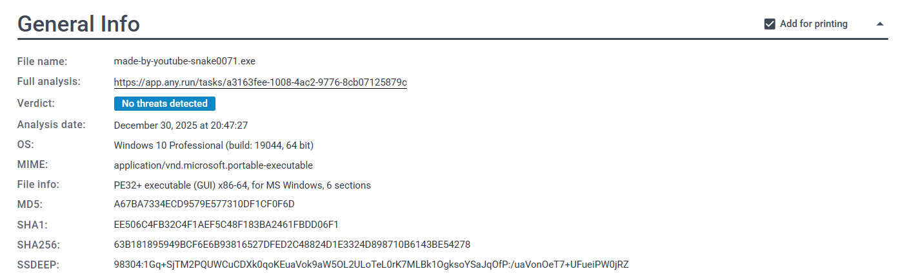
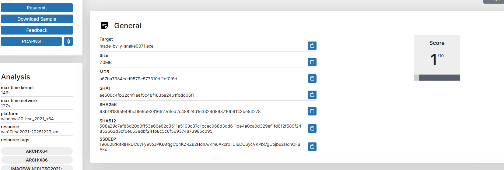
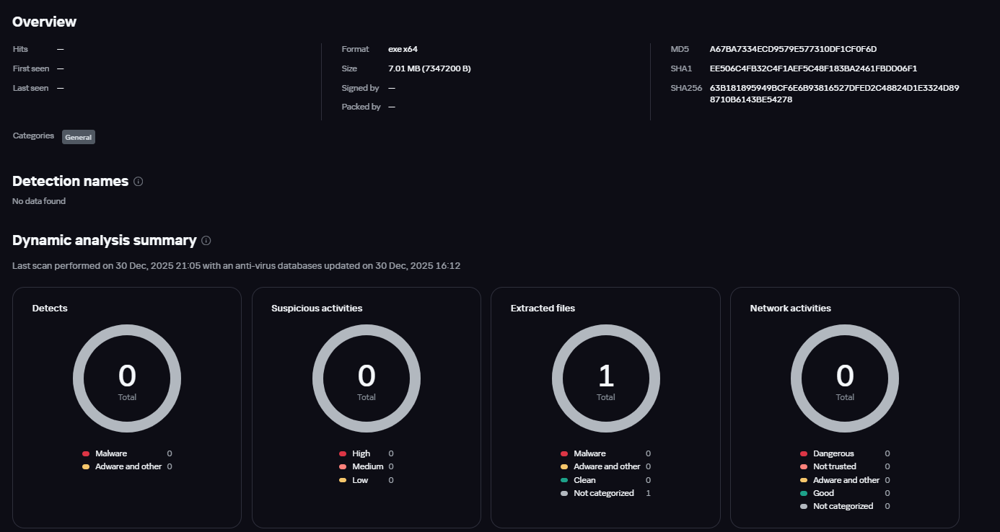

[🇰🇷 한국어 버전](./korean/README.md)

# Anti-VM: Sandbox Evasion Technique Based on Hardware Encoder

> ⚠️ **Disclaimer**
> This document is for educational and security research purposes only. Misusing the techniques described herein on unauthorized systems is illegal, and all responsibility lies with the user.

## Overview: New Anti-VM Approach Using Hardware Functional Gaps

While developing a screen recording program recently, I discovered an interesting phenomenon: **the hardware video encoder functionality of Windows Media Foundation (WMF) does not operate normally in virtual machine (VM) environments.**

While this feature is almost essential in real user PC environments, it is often unsupported in many VMs and automated analysis sandbox environments. In other words, a clear **'functional gap'** exists between real PCs and analysis environments.

I realized this difference could be applied to malware analysis evasion strategies and implemented a simple **PoC loader** to verify it. This document summarizes the technical principles and actual test results of the technique I discovered.

---

## Technical Principle: Environment Determination Based on Functional Execution

Instead of simple environment string comparisons or registry checks, this loader focuses on the question: "Can it actually perform hardware functions?" It uses a two-step verification procedure.

---

### Step 1: Enumerating Hardware Video Encoders (`MFTEnumEx`)

The first step is to check if a **Hardware Accelerated Video Encoder (MFT)** is registered in the system.

| API | Purpose | Key Flag |
| :--- | :--- | :--- |
| `MFTEnumEx` | Enumerate Media Foundation Transforms (MFT) | `MFT_ENUM_FLAG_HARDWARE` |

*   **Typical Real PC**: In environments with a GPU, hardware MFTs are registered, and the enumeration result is **greater than 0**.
*   **VM / Sandbox Environment**: Since most virtual environments do not expose hardware encoders, the result is returned as **0**. → In this case, the loader terminates immediately.

---

### Step 2: Verification Based on Functional Execution (`MFCreateSinkWriterFromURL`)

To prevent evasion by environments that simply spoof API results, the second step attempts to **initialize an actual hardware encoding pipeline**.

The verification flow is as follows:

1.  Set the `MF_READWRITE_ENABLE_HARDWARE_TRANSFORMS` attribute to force hardware acceleration.
2.  Create a `SinkWriter`.
3.  Attempt to start the encoding pipeline by calling `BeginWriting()`.

Even if a hardware MFT appears to exist, **it will inevitably fail at this stage if there is no actual driver or encoder.**

This completes a **functional verification** that is difficult to bypass with simple API hooking or dummy value returns.

---

## 🧪 PoC Test Results

To verify the effectiveness of the technique, I created a loader containing an actual malware payload and uploaded it to a total of **four automated analysis sandboxes, including Any.Run**, for testing.

### Test Results Summary

| Sandbox | Result | Description |
| :--- | :--- | :--- |
| Any.Run | **Success (Evasion)** | Loader judged it as a VM environment and terminated immediately. |
| Platform B | **Success (Evasion)** | Payload not executed. |
| Platform C | **Success (Evasion)** | No malicious activity logs. |
| Platform D | **Success (Evasion)** | Analysis failed. |

In all test environments, the loader recognized the analysis environment as a VM and terminated quietly, and the intended payload was not executed. This shows that **current mainstream automated analysis systems are vulnerable to this technique.**

---

### Test Result Screenshots

> 📌 Below are examples of screens where the loader terminated normally in each sandbox.

*   **Any.Run Result**
    

*   **Platform B**
    

*   **Platform C**
    

---

## Threat Model and Implications

### 1. Exploitation of the Hardware Gap

This technique accurately leverages the **realistic hardware differences** between general user environments and analysis servers.

*   **General User PC**: GPUs and hardware encoders are basically present for video playback and recording.
*   **Analysis Server / Sandbox**: Graphics functionality is minimized due to cost-efficiency and density issues.

This makes it a very suitable condition for info-stealing malware or banking Trojans to **evade security research environments and selectively attack only real users.**

---

### 2. Novelty and High Evasion Rate

*   **Differentiation in Approach**: Unlike existing Anti-VM techniques (CPUID, BIOS strings, registry checks, etc.), the method using WMF's multimedia subsystem is not yet widely known.
*   **High Evasion Rate**: Few sandboxes fully emulate complex media pipelines.

---

### 3. Analysis Difficulty of Rust-based Loader

The loader was written in the **Rust language**. Rust's unique binary structure and compiler optimizations reduce the efficiency of traditional C/C++ based static and dynamic analysis tools, further increasing the difficulty of analysis.

---

## 🛑 Limitations and Future Neutralization Possibilities

This technique is not a silver bullet, and the following limitations exist:

### 1. False Positives in Actual Server Environments

**Physical servers (DCs, file servers, etc.)** without GPUs may be mistaken for VMs. Therefore, it is not suitable for scenarios targeting server infrastructure.

---

### Conclusion

This document is a technical analysis and recommendation for a **new Anti-VM technique based on hardware functional execution** that I personally discovered and implemented.
